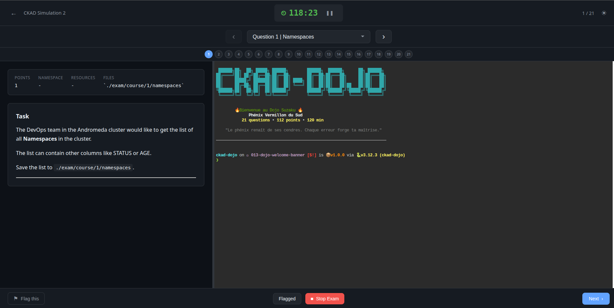

<p align="center">
  <pre>
 ██████╗██╗  ██╗ █████╗ ██████╗       ██████╗  ██████╗      ██╗ ██████╗
██╔════╝██║ ██╔╝██╔══██╗██╔══██╗      ██╔══██╗██╔═══██╗     ██║██╔═══██╗
██║     █████╔╝ ███████║██║  ██║█████╗██║  ██║██║   ██║     ██║██║   ██║
██║     ██╔═██╗ ██╔══██║██║  ██║╚════╝██║  ██║██║   ██║██   ██║██║   ██║
╚██████╗██║  ██╗██║  ██║██████╔╝      ██████╔╝╚██████╔╝╚█████╔╝╚██████╔╝
 ╚═════╝╚═╝  ╚═╝╚═╝  ╚═╝╚═════╝       ╚═════╝  ╚═════╝  ╚════╝  ╚═════╝
  </pre>
</p>

<h3 align="center">CKAD Exam Simulator</h3>

<p align="center">
  Practice for the Certified Kubernetes Application Developer exam under realistic conditions
</p>

<p align="center">
  
  
  
  
</p>

<p align="center">
  
  
  
  
</p>

---





## Overview

**ckad-dojo** is a local CKAD exam simulator that lets you practice under realistic exam conditions with:

- **Automated environment setup** - All namespaces, resources, and Helm releases pre-configured
- **Real-time scoring** - Instant feedback on 100+ criteria
- **Modern web interface** - Timer, question navigation, and dark mode
- **Idempotent scripts** - Safe to re-run at any time

---

## Features

| Feature | Description |
|---------|-------------|
| **21 Questions** | 20 main + 1 preview question covering all CKAD domains |
| **Web Interface** | Modern UI with 120-minute countdown timer |
| **Auto-Scoring** | 100+ criteria automatically evaluated |
| **Multi-Exam** | Support for multiple exam sets |
| **Themes** | Dark and light mode |

### Timer Warnings

| Time Remaining | Color |
|----------------|-------|
| > 15 min | Normal |
| 15 min | Yellow |
| 5 min | Orange |
| 1 min | Red |

---

## Quick Start

```bash
# 1. Install uv (Python package manager)
curl -LsSf https://astral.sh/uv/install.sh | sh

# 2. Launch the exam
./scripts/ckad-exam.sh
```

Opens `http://localhost:9090` with the exam interface.

---

## Prerequisites

### Required Tools

| Tool | Version | Purpose | Installation |
|------|---------|---------|--------------|
| Kubernetes cluster | 1.28+ | kubeadm, minikube, kind... | [kubernetes.io](https://kubernetes.io/docs/setup/) |
| `kubectl` | 1.28+ | Kubernetes CLI | `curl -LO "https://dl.k8s.io/release/$(curl -L -s https://dl.k8s.io/release/stable.txt)/bin/linux/amd64/kubectl"` |
| `helm` | 3.x | Package manager | `curl https://raw.githubusercontent.com/helm/helm/main/scripts/get-helm-3 \| bash` |
| `docker` | 20.x+ | Container runtime | [docs.docker.com](https://docs.docker.com/engine/install/) |
| `podman` | 4.x+ | Container runtime (Q11) | `apt install podman` or [podman.io](https://podman.io/getting-started/installation) |
| `ttyd` | 1.7+ | Embedded web terminal | `apt install ttyd` or [github.com/tsl0922/ttyd](https://github.com/tsl0922/ttyd) |
| `uv` | 0.4+ | Python package manager | `curl -LsSf https://astral.sh/uv/install.sh \| sh` |
| `bash` | 4.0+ | Script execution | Pre-installed on Linux |

### Verify Installation

```bash
# Check cluster connection
kubectl cluster-info

# Check all tools
kubectl version --client
helm version
docker --version
podman --version
ttyd --version
uv --version
bash --version
```

---

## Usage

### Web Interface (Recommended)

```bash
./scripts/ckad-exam.sh              # Interactive exam & question selection
./scripts/ckad-exam.sh web          # Same as above
./scripts/ckad-exam.sh -e ckad-simulation1 -q 5   # Start specific exam at question 5
```

**Launch Options:**

| Option | Description |
|--------|-------------|
| `-e, --exam EXAM` | Specify exam (skip interactive selection) |
| `-q, --question N` | Start at question N |
| `-y, --yes` | Skip confirmation prompts |
| `--no-terminal` | Disable embedded terminal panel |
| `--port PORT` | Use custom port (default: 9090) |
| `--terminal-port PORT` | Terminal port (default: 7681) |

**Embedded Terminal:**

The exam interface includes an embedded terminal panel (powered by ttyd) that displays alongside the questions. This provides a unified exam experience similar to the real CKAD exam.

- **Split Layout**: Questions on the left, terminal on the right
- **Resizable**: Drag the divider to adjust panel sizes
- **Persistent**: Terminal session persists across question navigation

**Keyboard Shortcuts:**

| Key | Action |
|-----|--------|
| `←` / `→` | Previous / Next question |
| `F` | Flag question for review |

### Terminal Mode

```bash
./scripts/ckad-exam.sh start    # Start exam with timer
./scripts/ckad-exam.sh timer    # Watch countdown (another terminal)
./scripts/ckad-exam.sh status   # Check exam status
```

### Manual Operations

```bash
./scripts/ckad-setup.sh         # Setup environment
./scripts/ckad-score.sh         # Check your score
./scripts/ckad-cleanup.sh       # Reset everything
```

---

## Scoring

```bash
./scripts/ckad-score.sh
```

```
═══════════════════════════════════════════════════════════════════
                           SCORE SUMMARY
═══════════════════════════════════════════════════════════════════

Question Score        Topic
-------- --------     -----------------------------
Q1       1/1          Namespaces
Q2       5/5          Pods
Q3       6/6          Job
...

═══════════════════════════════════════════════════════════════════

TOTAL SCORE: 87 / 113 (77%)

PASS - Congratulations!
```

---

## Path Mappings

| Exam Path | Local Path |
|-----------|------------|
| `/opt/course/N/` | `./exam/course/N/` |
| Registry | `localhost:5000` |

---

## Project Structure

```
ckad-dojo/
├── scripts/
│   ├── ckad-exam.sh          # Main launcher
│   ├── ckad-setup.sh         # Environment setup
│   ├── ckad-score.sh         # Automated scoring
│   ├── ckad-cleanup.sh       # Cleanup
│   └── lib/                  # Shared functions
├── web/                      # Web interface
├── exams/                    # Exam definitions
│   └── ckad-simulation1/
├── exam/course/              # Your answers (created by setup)
└── simulation1.md            # Questions with answers (reference)
```

---

## Tips

| Tip | Command |
|-----|---------|
| Use alias | `alias k=kubectl` |
| Generate YAML | `kubectl ... --dry-run=client -oyaml` |
| Check docs | kubernetes.io/docs (allowed in real exam) |
| Verify work | Run `./scripts/ckad-score.sh` after each question |

---

## Troubleshooting

<details>
<summary><strong>Web interface not loading</strong></summary>

```bash
uv --version                              # Check uv installed
lsof -i :9090                             # Check port availability
./scripts/ckad-exam.sh web --port 8888    # Use alternative port
```
</details>

<details>
<summary><strong>Q11 registry push fails</strong></summary>

```bash
# For Podman, disable TLS verification
podman push localhost:5000/image:tag --tls-verify=false
```
</details>

<details>
<summary><strong>Scoring shows 0 for completed questions</strong></summary>

- Verify resources are in correct namespace
- Check file paths match `./exam/course/N/filename`
- Ensure resource names match requirements
</details>

---

## Topics Covered

- Namespaces, Pods, Jobs, Deployments
- Helm management
- ServiceAccounts and Secrets
- Probes (Readiness/Liveness)
- Rollouts and rollbacks
- Services (ClusterIP, NodePort)
- Storage (PV, PVC, StorageClass)
- ConfigMaps and Secrets
- Logging sidecars
- InitContainers
- NetworkPolicies
- Resource requests and limits
- Labels and Annotations

---

<p align="center">
  <strong>For educational purposes only</strong>
</p>
