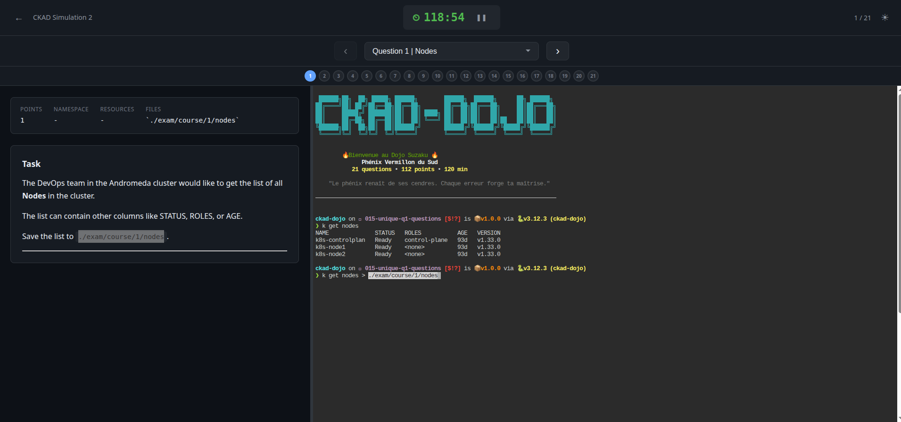

<p align="center">
  <pre>
 ██████╗██╗  ██╗ █████╗ ██████╗        ██████╗  ██████╗      ██╗ ██████╗
██╔════╝██║ ██╔╝██╔══██╗██╔══██╗       ██╔══██╗██╔═══██╗     ██║██╔═══██╗
██║     █████╔╝ ███████║██║  ██║ ████╗ ██║  ██║██║   ██║     ██║██║   ██║
██║     ██╔═██╗ ██╔══██║██║  ██║ ╚═══╝ ██║  ██║██║   ██║██   ██║██║   ██║
╚██████╗██║  ██╗██║  ██║██████╔╝       ██████╔╝╚██████╔╝╚█████╔╝╚██████╔╝
 ╚═════╝╚═╝  ╚═╝╚═╝  ╚═╝╚═════╝        ╚═════╝  ╚═════╝  ╚════╝  ╚═════╝
  </pre>
</p>

<h3 align="center">CKAD Exam Simulator</h3>

<p align="center">
  Practice for the Certified Kubernetes Application Developer exam under realistic conditions
</p>

<p align="center">
  
  
  
  
</p>

<p align="center">
  
  
  
  
  <a href="LICENSE"></a>
</p>

---





## Overview

**ckad-dojo** is a local CKAD exam simulator that lets you practice under realistic exam conditions with:

- **Automated environment setup** - All namespaces, resources, and Helm releases pre-configured

- **Real-time scoring** - Instant feedback on 100+ criteria

- **Modern web interface** - Timer, question navigation, and dark mode

- **Idempotent scripts** - Safe to re-run at any time


---

## Features

| Feature | Description |
|---------|-------------|
| **5 Dojos** | 101 questions across 5 themed dojos |
| **Unified CLI** | Single `uv run ckad-dojo` command for all operations |
| **Web Interface** | Modern UI with 120-minute countdown timer |
| **Auto-Scoring** | 400+ criteria automatically evaluated |
| **Interactive Menu** | Easy navigation without memorizing commands |
| **Themes** | Dark and light mode |
| **Dojo Welcome** | Personalized ASCII banner in embedded terminal |

### Timer Warnings

| Time Remaining | Color |
|----------------|-------|
| > 15 min | Normal |
| 15 min | Yellow |
| 5 min | Orange |
| 1 min | Red |

---

## The Five Dojos

Four dojos are themed after the Shishin (四神) — Four Celestial Guardians from East Asian mythology. The fifth dojo features the Kappa, a water spirit from Japanese folklore:

### 🐉 Dojo Seiryu — Dragon Azure de l'Est
>
> *"Le dragon s'élève avec la tempête. Que ton code déploie ses ailes."*

**22 questions • 113 points** — Planetary theme (Neptune, Saturn, Mars...)

### 🔥 Dojo Suzaku — Phénix Vermillon du Sud
>
> *"Le phénix renaît de ses cendres. Chaque erreur forge ta maîtrise."*

**21 questions • 112 points** — Constellation theme (Orion, Andromeda, Pegasus...)

### 🐯 Dojo Byakko — Tigre Blanc de l'Ouest
>
> *"Le tigre frappe avec précision. Un manifeste, une solution."*

**20 questions • 105 points** — Greek mythology theme (Olympus, Zeus, Athena...)

### 🐢 Dojo Genbu — Tortue Noire du Nord
>
> *"La tortue porte le monde. La patience est la clé du succès."*

**22 questions • 115 points** — Norse mythology theme (Odin, Thor, Asgard...)

### 🐸 Dojo Kappa — Kappa des Rivières
>
> *「河童は水を知る」 — Le kappa connait les eaux*

**16 questions • 88 points** — River/water theme (stream, pond, marsh, delta...)

---

## Quick Start

```bash
# 1. Install uv (Python package manager)
curl -LsSf https://astral.sh/uv/install.sh | sh

# 2. Launch the unified CLI (recommended)
uv run ckad-dojo

# Or use the bash script directly
./scripts/ckad-exam.sh
```

Opens `http://localhost:9090` with the exam interface.

---

## Installation

### Option 1: Global Installation (Recommended)

Install `ckad-dojo` globally to use it from anywhere:

```bash
# Install globally from PyPI (when published)
uv tool install ckad-dojo

# Or install from a local clone
git clone https://github.com/TiPunchLabs/ckad-dojo.git
uv tool install ./ckad-dojo

# Or install directly from GitHub
uv tool install git+https://github.com/TiPunchLabs/ckad-dojo.git
```

After installation, `ckad-dojo` is available system-wide:

```bash
ckad-dojo              # Interactive menu
ckad-dojo list         # List exams
ckad-dojo exam start   # Start an exam
```

**Manage the installation:**

```bash
uv tool list           # List installed tools
uv tool upgrade ckad-dojo   # Upgrade to latest version
uv tool uninstall ckad-dojo # Remove
```

### Option 2: Run from Repository

Run directly without global installation:

```bash
git clone https://github.com/TiPunchLabs/ckad-dojo.git
cd ckad-dojo
uv run ckad-dojo       # uv handles dependencies automatically
```

### Option 3: Bash Scripts Only

If you prefer not to use Python/uv:

```bash
git clone https://github.com/TiPunchLabs/ckad-dojo.git
cd ckad-dojo
./scripts/ckad-exam.sh # Direct bash execution
```

---

## Prerequisites

### Required Tools

| Tool | Version | Purpose | Installation |
|------|---------|---------|--------------|
| Kubernetes cluster | 1.28+ | kubeadm, minikube, kind... | [kubernetes.io](https://kubernetes.io/docs/setup/) |
| `kubectl` | 1.28+ | Kubernetes CLI | `curl -LO "https://dl.k8s.io/release/$(curl -L -s https://dl.k8s.io/release/stable.txt)/bin/linux/amd64/kubectl"` |
| `helm` | 3.x | Package manager | `curl https://raw.githubusercontent.com/helm/helm/main/scripts/get-helm-3 \| bash` |
| `docker` | 20.x+ | Container runtime | [docs.docker.com](https://docs.docker.com/engine/install/) |
| `ttyd` | 1.7+ | Embedded web terminal | `apt install ttyd` or [github.com/tsl0922/ttyd](https://github.com/tsl0922/ttyd) |
| `uv` | 0.4+ | Python package manager | `curl -LsSf https://astral.sh/uv/install.sh \| sh` |
| `bash` | 4.0+ | Script execution | Pre-installed on Linux |

### Verify Installation

```bash
# Check cluster connection
kubectl cluster-info

# Check all tools
kubectl version --client
helm version
docker --version
ttyd --version
uv --version
bash --version
```

---

## CLI Usage (Recommended)

The `ckad-dojo` CLI provides a unified interface for all exam operations:

```bash
# Interactive menu (run without arguments)
uv run ckad-dojo

# Direct commands
uv run ckad-dojo list                           # List all available exams
uv run ckad-dojo info -e ckad-simulation1       # View exam details
uv run ckad-dojo exam start -e ckad-simulation1 # Start exam (setup + web UI)
uv run ckad-dojo setup -e ckad-simulation1      # Setup only (no web UI)
uv run ckad-dojo score -e ckad-simulation1      # Score your answers
uv run ckad-dojo cleanup -e ckad-simulation1    # Cleanup resources
uv run ckad-dojo status                         # Check environment status
```

**CLI Options:**

| Option | Description |
|--------|-------------|
| `-e, --exam` | Specify exam ID |
| `-b, --browser` | Browser to use (firefox, chrome, chromium, brave, default) |
| `--no-color` | Disable colored output |
| `--help` | Show help |
| `--version` | Show version |

### Browser Selection

By default, the exam opens in your system's default browser. You can specify a different browser:

```bash
# Use Firefox
uv run ckad-dojo exam start -e ckad-simulation1 --browser firefox

# Use Chrome
uv run ckad-dojo exam start -e ckad-simulation1 --browser chrome

# Or set a default via environment variable
export CKAD_BROWSER=firefox
uv run ckad-dojo exam start -e ckad-simulation1
```

**Supported browsers:** `firefox`, `chrome`, `chromium`, `brave`, `default`

### Shell Autocompletion

Enable tab completion for commands, options, and exam IDs.

#### Global Installation (Recommended)

If you installed with `uv tool install`, autocompletion works automatically after activating argcomplete:

```bash
# Bash - add to ~/.bashrc
eval "$(register-python-argcomplete ckad-dojo)"

# Then reload
source ~/.bashrc
```

#### Local Repository Usage

If running with `uv run` from the repository, create a wrapper function:

```bash
# Add to ~/.bashrc (adjust the path to your installation)
ckad-dojo() {
    uv run --project /path/to/ckad-dojo ckad-dojo "$@"
}
eval "$(register-python-argcomplete ckad-dojo)"
```

Then reload: `source ~/.bashrc`

#### Usage

```bash
ckad-dojo <TAB>           # → setup, exam, score, cleanup, list
ckad-dojo exam <TAB>      # → start, --exam, --help
ckad-dojo -e <TAB>        # → ckad-simulation1, ckad-simulation2, ...
```

**Alternative: Built-in completion scripts**

<details>
<summary>Bash (without function wrapper)</summary>

```bash
# Save to completions directory
mkdir -p ~/.local/share/bash-completion/completions
uv run ckad-dojo completion bash > ~/.local/share/bash-completion/completions/ckad-dojo
```

</details>

<details>
<summary>Zsh</summary>

```bash
mkdir -p ~/.zfunc
echo 'fpath=(~/.zfunc $fpath)' >> ~/.zshrc
echo 'autoload -Uz compinit && compinit' >> ~/.zshrc
uv run ckad-dojo completion zsh > ~/.zfunc/_ckad-dojo
source ~/.zshrc
```

</details>

<details>
<summary>Fish</summary>

```bash
mkdir -p ~/.config/fish/completions
uv run ckad-dojo completion fish > ~/.config/fish/completions/ckad-dojo.fish
```

</details>

---

## Bash Scripts Usage

### Web Interface (Recommended)

```bash
./scripts/ckad-exam.sh              # Interactive exam & question selection
./scripts/ckad-exam.sh web          # Same as above
./scripts/ckad-exam.sh -e ckad-simulation1 -q 5   # Start specific exam at question 5
```

**Launch Options:**

| Option | Description |
|--------|-------------|
| `-e, --exam EXAM` | Specify exam (skip interactive selection) |
| `-q, --question N` | Start at question N |
| `-y, --yes` | Skip confirmation prompts |
| `--no-terminal` | Disable embedded terminal panel |
| `--no-docs` | Don't open K8s/Helm documentation tabs |
| `--no-pause` | Disable timer pause functionality |
| `--browser NAME` | Browser to use (firefox, chrome, chromium, brave, default) |
| `--port PORT` | Use custom port (default: 9090) |
| `--terminal-port PORT` | Terminal port (default: 7681) |

**Embedded Terminal:**

The exam interface includes an embedded terminal panel (powered by ttyd) that displays alongside the questions. This provides a unified exam experience similar to the real CKAD exam.

- **Split Layout**: Questions on the left, terminal on the right
- **Resizable**: Drag the divider to adjust panel sizes
- **Persistent**: Terminal session persists across question navigation

**Keyboard Shortcuts:**

| Key | Action |
|-----|--------|
| `←` / `→` | Previous / Next question |
| `F` | Flag question for review |

### Terminal Mode

```bash
./scripts/ckad-exam.sh start    # Start exam with timer
./scripts/ckad-exam.sh timer    # Watch countdown (another terminal)
./scripts/ckad-exam.sh status   # Check exam status
```

### Manual Operations

```bash
./scripts/ckad-setup.sh         # Setup environment
./scripts/ckad-score.sh         # Check your score
./scripts/ckad-cleanup.sh       # Reset everything
```

---

## Scoring

```bash
./scripts/ckad-score.sh
```

```
═══════════════════════════════════════════════════════════════════
                           SCORE SUMMARY
═══════════════════════════════════════════════════════════════════

Question Score        Topic
-------- --------     -----------------------------
Q1       1/1          Namespaces
Q2       5/5          Pods
Q3       6/6          Job
...

═══════════════════════════════════════════════════════════════════

TOTAL SCORE: 87 / 113 (77%)

PASS - Congratulations!
```

---

## Path Mappings

| Exam Path | Local Path |
|-----------|------------|
| `/opt/course/N/` | `./exam/course/N/` |
| Registry | `localhost:5000` |

---

## Project Structure

```
ckad-dojo/
├── ckad_dojo.py              # Unified Python CLI
├── pyproject.toml            # Python project config (uv)
├── scripts/
│   ├── ckad-exam.sh          # Main launcher (bash)
│   ├── ckad-setup.sh         # Environment setup
│   ├── ckad-score.sh         # Automated scoring
│   ├── ckad-cleanup.sh       # Cleanup
│   └── lib/                  # Shared functions
├── web/                      # Web interface
├── exams/                    # Exam definitions
│   ├── ckad-simulation1/     # Dojo Seiryu 🐉 - 22 questions, 113 points
│   ├── ckad-simulation2/     # Dojo Suzaku 🔥 - 21 questions, 112 points
│   ├── ckad-simulation3/     # Dojo Byakko 🐯 - 20 questions, 105 points
│   ├── ckad-simulation4/     # Dojo Genbu 🐢 - 22 questions, 115 points
│   └── ckad-simulation5/     # Dojo Kappa 🐸 - 16 questions, 88 points
├── exam/course/              # Your answers (created by setup)
└── tests/                    # Unit tests
```

---

## Tips

| Tip | Command |
|-----|---------|
| Use alias | `alias k=kubectl` |
| Generate YAML | `kubectl ... --dry-run=client -oyaml` |
| Check docs | kubernetes.io/docs (allowed in real exam) |
| Verify work | Run `./scripts/ckad-score.sh` after each question |

---

## Troubleshooting

<details>
<summary><strong>Web interface not loading</strong></summary>

```bash
uv --version                              # Check uv installed
lsof -i :9090                             # Check port availability
./scripts/ckad-exam.sh web --port 8888    # Use alternative port
```

</details>

<details>
<summary><strong>Q11 registry push fails</strong></summary>

```bash
# For Docker, ensure the registry is in the insecure registries list
# Edit /etc/docker/daemon.json and add:
# { "insecure-registries": ["localhost:5000"] }
# Then restart Docker: sudo systemctl restart docker
```

</details>

<details>
<summary><strong>Scoring shows 0 for completed questions</strong></summary>

- Verify resources are in correct namespace
- Check file paths match `./exam/course/N/filename`
- Ensure resource names match requirements

</details>

---

## Topics Covered

- Namespaces, Pods, Jobs, Deployments
- Helm management
- ServiceAccounts and Secrets
- Probes (Readiness/Liveness)
- Rollouts and rollbacks
- Services (ClusterIP, NodePort)
- Storage (PV, PVC, StorageClass)
- ConfigMaps and Secrets
- Logging sidecars
- InitContainers
- NetworkPolicies
- Resource requests and limits
- Labels and Annotations

---

## Contributing

This is an open source project and contributions are welcome!

### Report a Bug

Found a bug? Please [open an issue](https://github.com/TiPunchLabs/ckad-dojo/issues/new?template=bug_report.md) with:

- A clear description of the problem
- Steps to reproduce
- Expected vs actual behavior
- Your environment (OS, kubectl version, etc.)

### Suggest an Improvement

Have an idea to make ckad-dojo better? [Create a feature request](https://github.com/TiPunchLabs/ckad-dojo/issues/new?template=feature_request.md) with:

- Description of the proposed feature
- Use case and benefits
- Any implementation ideas (optional)

### Development Setup

This project uses [direnv](https://direnv.net/) and [pre-commit](https://pre-commit.com/) for a consistent development environment.

```bash
# 1. Install direnv (if not already installed)
# Ubuntu/Debian: sudo apt install direnv
# macOS: brew install direnv

# 2. Allow direnv for this project
direnv allow

# 3. Install pre-commit hooks
uv sync --group dev
pre-commit install
pre-commit install --hook-type commit-msg
```

**Pre-commit hooks include:**

| Hook | Purpose |
|------|---------|
| `shellcheck` | Shell script linting |
| `shfmt` | Shell script formatting |
| `flake8` | Python linting |
| `yamllint` | YAML validation |
| `markdownlint` | Markdown formatting |
| `gitleaks` | Secret detection |
| `commitizen` | Conventional commit messages |

### Submit a Pull Request

1. Fork the repository
2. Create a feature branch (`git checkout -b feature/my-feature`)
3. Make your changes
4. Test your changes (`./tests/run-tests.sh`)
5. Run pre-commit checks (`pre-commit run --all-files`)
6. Commit with a [conventional message](https://www.conventionalcommits.org/) (`feat:`, `fix:`, `docs:`, etc.)
7. Open a Pull Request

All contributions must respect the [CC BY-NC-SA 4.0](LICENSE) license.

---

## Credits

Special thanks to the following contributors whose work has been adapted for this project:

| Dojo | Source | Author |
|------|--------|--------|
| 🐸 Dojo Kappa (Simulation 5) | [CKAD-Practice-Questions](https://github.com/aravind4799/CKAD-Practice-Questions) | [@aravind4799](https://github.com/aravind4799) |

---

## License

This project is licensed under the **Creative Commons Attribution-NonCommercial-ShareAlike 4.0 International** (CC BY-NC-SA 4.0).

**You are free to:**

- Use, copy, and share this project for personal and educational purposes
- Modify and create derivative works (under the same license)

**You may NOT:**

- Use this project for commercial purposes without explicit permission
- Sell or include in paid products/services

For commercial licensing, please contact the author.

See the [LICENSE](LICENSE) file for full details.

---

<p align="center">
  <strong>For educational purposes only</strong>
</p>
